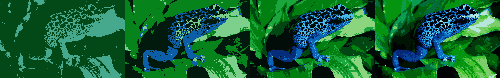

# Color-Quantization
Color quantization is the process of reducing number of colors used in an image while trying to maintain the visual appearance of the original image. In general, it is a form of cluster analysis, if each RGB color value is considered as a coordinate triple in the 3D colorspace. 
# How To Run
There are two possible run modes:
* **0** - Kmeans with the points you choose by clicking on the image
* **1** - Kmeans with the random initial points (*suggested for ease of usage*)

After you install all the dependencies on Python3 use the following command:

`python color-quantization.py [Path to image file] [K value] [Run Mode]`

# Results
### Original Image
 

### Outputs for K=2, K=4, K=8, K=16

